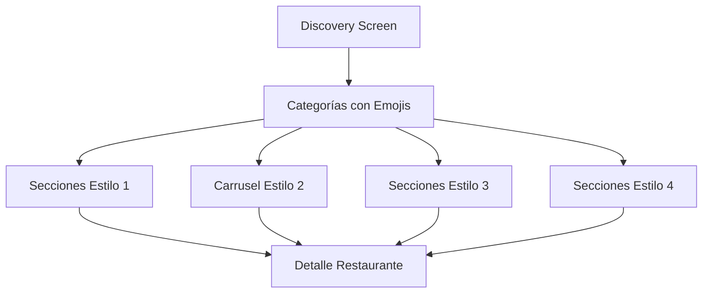

## 1. Product Overview
Rediseño de la pantalla Discovery de la app de delivery para mejorar la experiencia visual con emojis en categorías y nuevas secciones de restaurantes. Los usuarios podrán navegar más intuitivamente y descubrir opciones de comida organizadas por estilos visuales específicos.

## 2. Core Features

### 2.1 User Roles
| Role | Registration Method | Core Permissions |
|------|---------------------|------------------|
| Usuario Normal | Email o redes sociales | Navegar restaurantes, hacer pedidos, filtrar por categorías |
| Usuario Invitado | Sin registro | Ver restaurantes y menús, no puede ordenar |

### 2.2 Feature Module
La pantalla Discovery consta de las siguientes secciones principales:
1. **Categorías de comida**: botones con emojis en lugar de iconos neon
2. **Secciones de restaurantes**: 4 secciones estilo 1, 1 carrusel estilo 2, 2 secciones estilo 3, 5+ secciones estilo 4
3. **Barra de búsqueda**: búsqueda rápida de restaurantes y platos
4. **Filtros adicionales**: por distancia, tiempo de entrega, precio

### 2.3 Page Details
| Page Name | Module Name | Feature description |
|-----------|-------------|---------------------|
| Discovery Screen | Header | Barra de búsqueda prominente con filtros rápidos |
| Discovery Screen | Categorías de comida | 8-10 botones con emojis (🍔🌮🍕🥗🍜🍣🍰☕) en grid responsivo |
| Discovery Screen | Sección estilo 1 (4 secciones) | Cards horizontales con imagen grande, título negro bold, meta datos con íconos, badge promocional amarillo |
| Discovery Screen | Carrusel estilo 2 (1 sección) | Card full-width con fondo beige, texto marrón, 40% OFF promoción, indicadores de carrusel |
| Discovery Screen | Sección estilo 3 (2 secciones) | Cards con ícono verde "+" en esquina, precios con descuento, texto tachado en gris |
| Discovery Screen | Secciones estilo 4 (5+ secciones) | Lista vertical minimalista con títulos, badges promocionales, información básica del restaurante |

## 3. Core Process
Flujo de navegación principal del usuario:
1. Usuario abre app → Pantalla Discovery carga
2. Usuario ve categorías con emojis → Selecciona categoría deseada
3. Sistema filtra restaurantes → Muestra secciones organizadas por estilo visual
4. Usuario desplaza verticalmente → Explora diferentes secciones de restaurantes
5. Usuario selecciona restaurante → Navega a detalles del restaurante

## 4. User Interface Design

### 4.1 Design Style
- **Colores primarios**: Negro para textos principales, amarillo para promociones, verde para acciones
- **Colores secundarios**: Gris para textos secundarios, beige para fondos promocionales
- **Botones**: Redondeados con sombras suaves, emojis de tamaño 24-32px
- **Tipografía**: Sans-serif moderna, títulos bold grandes (24-32px), texto normal 14-16px
- **Layout**: Card-based con espaciado generoso, navegación por secciones

### 4.2 Page Design Overview
| Page Name | Module Name | UI Elements |
|-----------|-------------|-------------|
| Discovery | Categorías | Grid 2x5 con emojis 32px, fondo blanco, bordes redondeados 12px, sombra sutil |
| Discovery | Cards estilo 1 | Imagen 16:9, título 24px bold negro, meta 14px gris con íconos, badge amarillo redondeado |
| Discovery | Carrusel estilo 2 | Fondo beige claro, texto marrón oscuro, 40% OFF en 48px bold, indicadores puntos centrados |
| Discovery | Cards estilo 3 | Precio 20px bold negro, descuento amarillo, texto tachado gris, ícono + verde 24px |
| Discovery | Lista estilo 4 | Texto minimalista 16px, badges pequeños amarillos, espaciado 16px entre items |

### 4.3 Responsiveness
Diseño mobile-first con adaptación para tablets. Las cards se reorganizan de 1 columna (móvil) a 2-3 columnas (tablet/desktop). Los emojis mantienen tamaño legible en todos los disposit